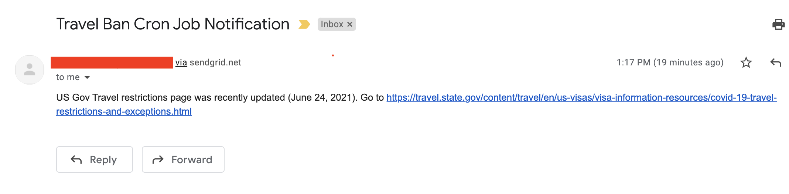

# Description

Google Cloud Function that receives a date from a web scraper on US Gov Travel Covid-19 restrictions page and notifies a list of email subscribers should the site has been updated recently 

# User story

Given the US Gov Travel Covid-19 restrictions page:

Let's say, yesterday, the `Last updated` date was `June 23, 2021`. And that's the date we have in our DataStore.

But today, the cron job runs again, triggers the web scraper, and returns a new date: `June 24, 2021`.

In this case, the whole list of people that have subscribed to this point, will receive an email like the following: 

# Environmental variables

* SENDGRID_EMAIL_API_KEY = (sendgrid API key, must be obtained from Sendgrid's website)
* TRAVEL_SITE_URL = (link to US Gov Travel Covid 19 Restrictions page)
* SENDER = (email account from which the subscribers will be notified)

# Related repositories

* US Gov Travel Covid 19 Restrictions page scraper https://github.com/gonzalofh/travel-ban-updates
# Tools used

* SendGrid Email API https://app.sendgrid.com/
* Google Cloud Functions https://cloud.google.com/functions
* Google Cloud Datastore https://cloud.google.com/datastore
* Python 3 
